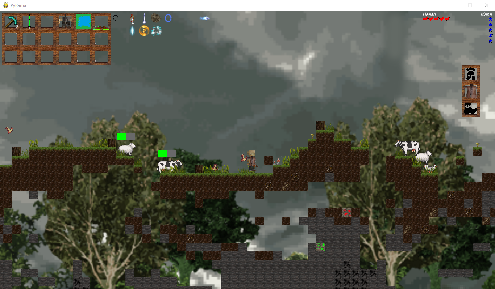

# PyRarria | 2020

## O Projekcie
PyRarria to platformowa gra zręcznościowa z otwartym światem w całości napisana w Pythonie. Zadaniem gracza jest przetrwać zmasowane ataki przeciwników oraz rozwijać swoje uzbrojenie i ekwipunek, eksplorując mapę. Mapa w PyRarrii składa się z dwóch części - części naziemnej, gdzie gracz zdobywa pożywienie i walczy z mobami oraz części podziemnej, gdzie poszukiwać możemy drogocennych kruszców, potrzebnych do wyrabiania bardziej skomplikowanych narzędzi, np. rudy miedzi. Gracz posiada ekwipunek, w którym może gromadzić zbierane przedmioty. Dodatkowo gracz może wyposażyć się w zbroję, miecz oraz łuk. Podczas walki, oprócz standardowej broni gracz może użyć jednego z wielu dostępnych zaklęć.  

ENG:
PyRarria is an open-world platform arcade game written entirely in Python. The player's task is to survive massive enemy attacks and develop their weapons and equipment by exploring the map. The map in PyRarria consists of two parts - the ground part, where the player obtains food and fights mobs, and the underground part, where we can search for precious ores, needed to make more complex tools, e.g. copper ore. The player has equipment, in which he can collect collected items. Additionally, the player can equip himself with armor, a sword and a bow. During the fight, in addition to the standard weapon, the player can use one of many available spells.
  

## Wykorzystane narzędzia
* Python 3
* pygame 2.0.1
